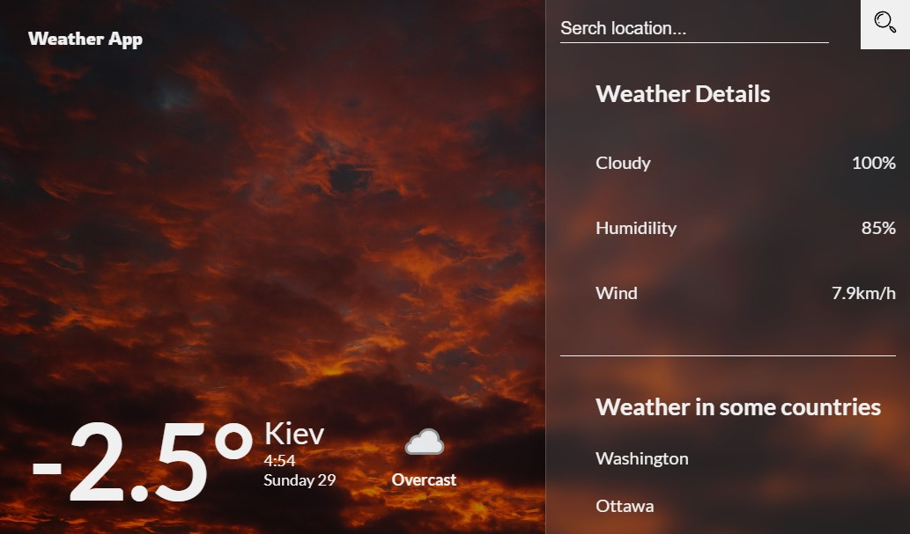

# Weather App

If you  want to try it,  follow this link: [Weather App]()

## Usage

This is an adaptive weather app.

When you open my application, for the first you will see the weather in the Kyiv.

On the right side you can see the serch form and some info about weather in current city.
At the serch form you can type the name of the city whose weather you need.

Also in the sidebar you can see the weather in the capitals of 7 popular countries: USA, Canada, France, Germany, Italy, Japan, UK.
You can click on them.

Enjoy!

## API

API wich i used [**WeatherAPI**](https://www.weatherapi.com/)

## Libraries

[**React**](https://github.com/facebook/create-react-app)

[**sass**](https://github.com/sass/dart-sass)

[**ReactSpinners**](https://github.com/davidhu2000/react-spinners)

[**Redux**](https://github.com/reduxjs/redux)

[**Redux Toolkit**](https://github.com/reduxjs/redux-toolkit)

## Design idea 

Original design [Weather App](https://dribbble.com/shots/7118235-Weather-DailyUI-037/attachments/121070?mode=media)